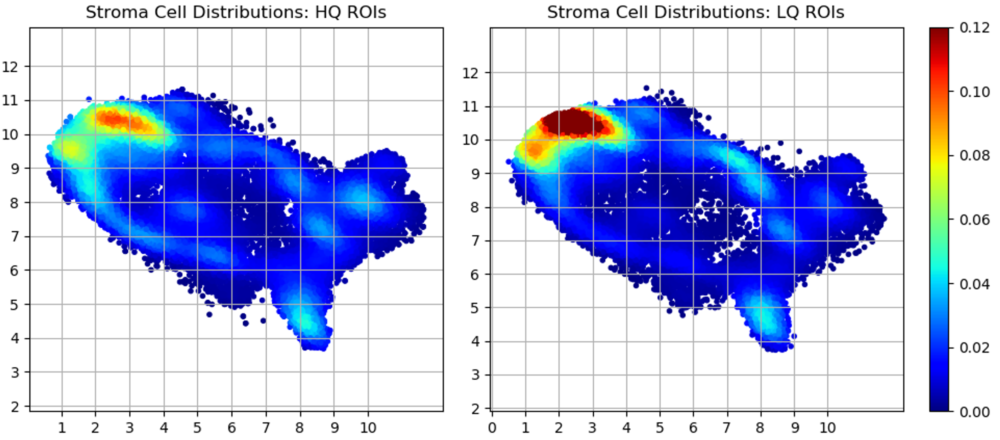

# INCell MxIF Quality Assessment 

This repository contains code linked to pre-publication work of ....
The code contained within has been developed to generate metrics and report the image quality coming from he Cytiva/Leica INCEll MxIF Microscope.

## Installation & Setup (MacOS/Linux)

Clone this Repository:

    git clone https://github.com/smujiang/MxIF_DAPI_ref_QC.git

Configure your Python enviroment: 
   
    #Check Version (> 3.7.x):
    python --version
    
    #Install Dependancies:
    pip install --upgrade -r requirements.txt 

# Usage

## Python Utility Script

### Compute metrics on images and create reports

__Filename:__ `run_dapi_ref_qc.py`

__Purpose:__ This python script is intended to automatically evaluate MxIF image qualities using DAPI rounds as reference.
1. QC reports will be created, including json and html versions.
2. Intermedia evaluation metrics will be saved for advanced users.

__CLI:__ `python run_dapi_ref_qc.py -i <path to processor dir> -o <path to output dir> -c <case id to be evaluated>`

### Example report

### Cell distribution differences
We also compared the cell distribution differences between high-quality group (HQ, FOVs passed our QC) and low-quality group (LQ, FOVs failed our QC).

We found that in stroma cell, 
1) LQ group presented higher density in some region (elevated more than 20%).   
2) HQ and LQ group share similar cell distribution, that's because:   
    a) there are “high quality” sub-regions within LQ FOVs;   
    b) there are undetected LQ FOVs within HQ group

